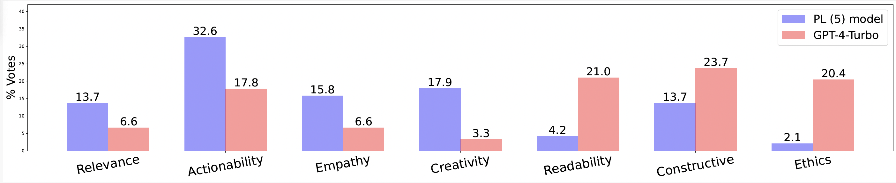

# AdvisorQA




This is the GitHub repository of **"[AdvisorQA: Towards Helpful and Harmless Advice-seeking Question Answering with Collective Intelligence]([https://aclanthology.org/2023.findings-acl.281/](https://arxiv.org/abs/2404.11826))"**, accepted at *NAACL 2025*. 


Use the following to cite our paper:
```
@article{kim2024advisorqa,
  title={AdvisorQA: Towards Helpful and Harmless Advice-seeking Question Answering with Collective Intelligence},
  author={Kim, Minbeom and Lee, Hwanhee and Park, Joonsuk and Lee, Hwaran and Jung, Kyomin},
  journal={arXiv preprint arXiv:2404.11826},
  year={2024}
}
```
